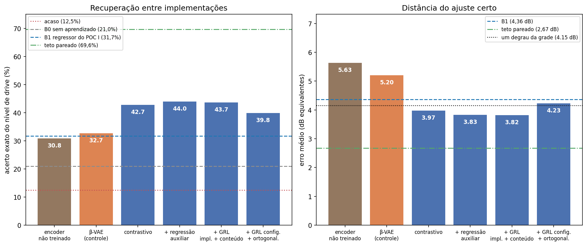
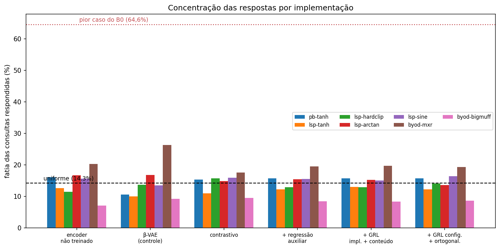
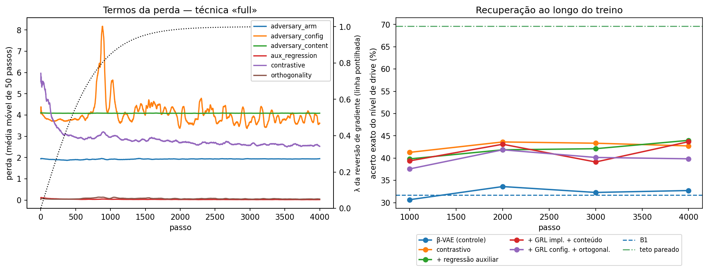
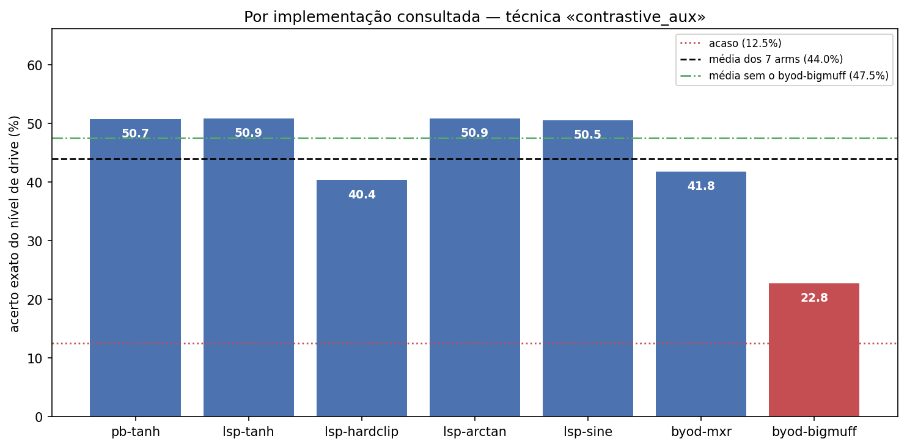

# POC II — estado do trabalho em 7 de setembro de 2026

Duas versões no mesmo arquivo. A **completa** registra cada decisão com o número
que a motivou. A **for dummies** conta a mesma história sem jargão. Para o slide
do orientador, a seção final da versão completa (“Resumo executivo”) é o
intermediário: dá para transformá-la em 5 ou 6 tópicos.

---

# PARTE 1 — VERSÃO COMPLETA

## 1. Contexto e pergunta

O POC I reproduziu Hinrichs et al.: uma CNN que regride os parâmetros de efeitos
de guitarra a partir do áudio, treinada sobre um dataset derivado das gravações
de Rossi et al. Funcionou — para **uma implementação específica** de cada efeito.

Um estudo preliminar (`gefx.crossimpl`) mostrou que esses modelos são
**específicos da implementação**: aplicados a outro plugin que faz o “mesmo”
efeito, a regressão degrada. O POC II ataca isso com desemaranhamento
(*disentanglement*), começando pela distorção.

A pergunta original era: *como traduzir a quantidade de distorção entre
implementações que não compartilham unidade de ganho?*

**A reformulação que orienta todo o trabalho:** não é um problema de conversão de
unidade, é de **equivalência sônica**. O ajuste correto em B não é “o mesmo
número” do ajuste em A — é o que **soa** mais próximo. Isso só é decidível
medindo, e é o que a calibração e o oráculo fazem.

## 2. Decisões de desenho

### 2.1 Recuperação em vez de regressão

O modelo não regride um vetor de parâmetros em unidade física. Ele leva o áudio a
um código `z_efeito`, monta-se um catálogo por implementação, e responde-se por
vizinho mais próximo — já nos controles da implementação disponível.

**Razão:** não existe unidade física comum entre implementações de distorção.
Regredir “drive em dB” só faz sentido dentro de uma implementação.

### 2.2 O oráculo sônico é a verdade fundamental

Para cada nível `p` da referência, o nível de B que casa é

    q*(p) = argmin_q  média_s  D( x[A,p,s] , x[B,q,s] )

com `D` = L1 sobre log-mel multi-resolução (janelas 512/1024/2048/4096), sobre os
mesmos conteúdos `s`. Isso é possível porque a grade é **pareada por conteúdo**:
o conteúdo cancela na diferença e sobra a diferença de tratamento.

**Objeção levantada pelo usuário e sua resposta** — *“usar uma métrica de
distância como oráculo não invalida a necessidade da rede?”* Não, e a razão é
específica: o oráculo é **pareado por conteúdo**, o que exige o sinal seco da
referência tocando o mesmo trecho. Isso não existe no uso real, onde a referência
é outra execução, em outro equipamento. O oráculo é professor, não produto: a
rede aprende uma versão dele **invariante ao conteúdo**. O baseline que mede a
margem real é a **distância marginal** (mesma `D` sobre estatísticas médias do
catálogo, sem pareamento), e ele é obrigatório antes de investir no
desemaranhamento.

**Auto-validação:** no par `pedalboard-tanh` ↔ `lsp-tanh` (mesma curva tanh,
mesma unidade em dB), o oráculo tem de recuperar a identidade. **Recupera:**
diagonal perfeita nos 8 níveis, com contraste entre 8,45 e 13,64.

### 2.3 Estratificação do roster

- **S1** — mesma forma de não-linearidade e mesma unidade: `pedalboard-tanh`
  (referência), `lsp-tanh`
- **S2** — mesma unidade (`input_gain_db`), forma diferente:
  `lsp-hardclip`, `lsp-arctan`, `lsp-sine`
- **S3** — unidade e topologia diferentes: `byod-mxr`, `byod-bigmuff`

**Razão:** permite atribuir a falha. O S2 é ablação controlada da *forma* da
não-linearidade — mesmo plugin, mesma unidade, só a sigmoide muda. É ele que
demonstra que equivalência nominal é falsa mesmo com unidade idêntica.

**Evidência dessa demonstração:** para produzir a mesma quantidade de distorção,
os quatro arms do LSP — que compartilham o parâmetro `input_gain_db` do mesmo
plugin — precisam de valores visivelmente diferentes. No piso do eixo:
hard clip 13,78 dB, arctan 7,03 dB, sine 10,13 dB, tanh 8,67 dB. Quase 7 dB de
diferença no mesmo knob do mesmo plugin.

### 2.4 O tom é estágio nosso, não dos plugins

Passa-baixas de 1 polo aplicado **depois** da não-linearidade, idêntico em todos
os arms, com os controles de tom nativos fixados em neutro.

**Razão:** isso o torna um fator exatamente compartilhado entre implementações, e
portanto **controle positivo** do desemaranhamento — não teste de generalização.
Precisa estar declarado assim no relatório.

### 2.5 Fatores desemaranhados: efeito / conteúdo / implementação

Equalização ficou de fora **de propósito**: EQ pós-distorção é literalmente a
mesma transformação que o parâmetro de tom (tarefa mal posta), e EQ pré-distorção
é variação de guitarra e captador — ou seja, já é conteúdo.

### 2.6 Técnica da fase 1

Quadrante da taxonomia de Wang et al. (2024): **vector-wise, supervisionada,
plana, com hipótese de independência** — cabível porque a grade totalmente
cruzada rotula todos os fatores. Contrastivo supervisionado na configuração,
reversão de gradiente (Ganin) removendo implementação e conteúdo de `z_efeito`,
mais ortogonalidade. **Sem decoder.** β-VAE entra só como controle que se espera
falhar, citando Locatello et al. (2019).

**Compromisso registrado:** a fase 1 tem de ser barata de estender para a fase 2
(decoder + troca de códigos). As *seams* já estão na fase 1 — o `sampler` emite
`swap_target`, o `encode()` é separado das cabeças, as perdas ficam num registro,
e o id do arm vai no batch. Há um teste que protege isso
(`test_swap_target_is_exactly_the_missing_corner`).

## 3. O roster: como chegou a 7

### 3.1 Aceitos

| arm | estrato | knob | por quê |
|---|---|---|---|
| `pedalboard-tanh` | S1 | `drive_db` 5–40 | referência in-domain; é a faixa do catálogo do POC I |
| `lsp-tanh` | S1 | `input_gain_db` | mesma curva e unidade da referência: é a checagem de identidade |
| `lsp-hardclip` | S2 | `input_gain_db` | clipping duro |
| `lsp-arctan` | S2 | `input_gain_db` | sigmoide intermediária |
| `lsp-sine` | S2 | `input_gain_db` | sigmoide com dobra |
| `byod-mxr` | S3 | `in_gain` | op-amp com clipping de diodo para a terra |
| `byod-bigmuff` | S3 | `in_gain` | quatro transistores em cascata, clipping simétrico |

### 3.2 Rejeitados, com o número que os reprovou

**`chowtape` (CHOWTapeModel)** — teto **físico** de THD 0,172, medido no topo
nativo do `input_gain`. Saturação de fita é suave por construção. Como a faixa
comum é a interseção, ele sozinho travava o eixo de todos em 0,166 — foi a causa
do “tudo soa limpo demais” no primeiro teste de escuta.

**`chowcentaur` (ChowCentaur)** — teto físico de 0,177 (mesmo problema) **e** piso
de 0,029, por nunca ficar limpo: travava o teto e levantava o piso ao mesmo
tempo. Essas duas são as razões decisivas, ambas duras.
*Ressalva registrada:* o `gain` dele também funciona como controle de tom (a
razão de agudos varia 36–50× ao longo do drive, em qualquer ajuste de `treble`,
contra 1,2× na referência). Isso **sozinho não desqualifica** — a grade é
totalmente cruzada, então drive e tom continuam separáveis por construção, e
pedais reais ficam mesmo mais brilhantes com mais ganho. O `byod-bigmuff`, que
está no roster, varia 107×.

**`byod-hotfuzz`** — o caso mais instrutivo. Passava em **tudo** que a porteira
media: rho 1,000, THD de 0,010 a 0,740 (a maior faixa do roster). E mesmo assim
tinha o eixo **perceptualmente degenerado**: ao longo de toda a faixa do
experimento, a compressão da guitarra variava **0,23 dB** (os outros variam 1,3 a
7,6), e o contraste do oráculo caía para 27% no topo, contra ~1000% do `lsp-tanh`.
*Causa:* o THD era medido em senoide casada no **pico** da guitarra, e senoide
fica no pico o tempo todo enquanto guitarra tem 15 dB de fator de crista. Num
circuito de limiar abrupto a senoide é ceifada quase sempre e a guitarra só nas
pontas — mesmo THD medido, quantidades percebidas incomparáveis.

**`byod-gainfulclipper`** — melhor variação de compressão medida (7,57 dB), mas
piso de THD 0,0303, acima do piso do eixo: repetiria o defeito do chowcentaur.

**`byod-tubescreamer`** — teto de THD 0,168, mesmo problema da chowtape.

**`byod-rat`** — piso em THD 0,094 (nunca limpa) e não monótono (rho −0,21).

**`byod-kingoftone`** — saída identicamente silenciosa na faixa sondada.

**`surge-xt`** — os 13 slots genéricos não mudam com o `fx_type`; não dá para
saber que valor foi setado nem garantir reprodutibilidade.

### 3.3 Rejeições que estavam ERRADAS

Uma versão anterior do roster rejeitava `byod-bigmuff` (piso THD 0,084),
`byod-tubescreamer` (rho +0,29) e `byod-rat` (rho +0,04). **Essas medições estavam
erradas:** foram feitas trocando `program` sem esperar o DSP do BYOD, então
mediram o circuito anterior. Refeitas com espera, o Big Muff tem piso 0,0087 e
rho 1,000 — e voltou ao roster, onde é o arm mais bem separado internamente.

## 4. Calibração

### 4.1 O problema e a estratégia

Implementações não compartilham unidade, então “o mesmo valor de knob” não quer
dizer “a mesma quantidade de distorção”. A calibração varre o knob de cada arm,
mede um descritor de quantidade, e escolhe os valores que casam contra a
referência.

**Refinamento por bisseção medida, não interpolação.** Interpolar linearmente na
varredura falha onde a curva tem joelho: medido no hard clip, a interpolação
errava o extremo inferior em **4,4 dB** equivalentes — e isso não é erro de
relatório, porque `k_lo` e `k_hi` definem os níveis que vão para o disco.

### 4.2 A escolha do descritor: três etapas

**Etapa 1 — THD.** Escolha inicial, padrão em engenharia de áudio, independente de
unidade. Reprovada pela escuta: com o THD casado em 0,327 nos extremos, os dois
arms do BYOD soavam visivelmente mais distorcidos no topo.

**Etapa 2 — planicidade espectral.** Testei quatro candidatos contra a ordenação
que o ouvido deu (`bigmuff > mxr > resto`):

| descritor | ordenação produzida | bate com o ouvido? |
|---|---|---|
| crest factor | arctan > pb-tanh > … > bigmuff > mxr | não (invertida) |
| razão de agudos | mxr > bigmuff > … | quase (troca os dois primeiros) |
| centroide espectral | mxr > arctan > … > bigmuff | não (bigmuff em último) |
| **planicidade espectral** | **bigmuff > mxr > hardclip > …** | **sim** |

A planicidade mede o quanto o espectro é ruidoso em vez de tonal; distorção
pesada preenche os vales entre os harmônicos. É essencialmente uma *tonalness*
rudimentar, que a literatura (Aures, 1985) já aponta como um dos quatro
componentes psicoacústicos afetados por distorção — ou seja, cheguei por
tentativa e erro a um proxy de algo estabelecido.

**Etapa 3 — a combinação, que é o que está em uso.** Uma bancada offline sobre as
varreduras já gravadas revelou que os dois falham em pontas opostas, e a falha
não é de monotonicidade — é de **identificabilidade**, que é pior porque não
aparece no rho:

| descritor | arms aceitos | eixo | knob ambíguo no piso | no teto |
|---|---|---|---|---|
| THD | 7/7 | 22,1 dB | 0,0 dB | **10,1 dB** |
| planicidade | 6/7 | 27,1 dB | **13,5 dB** | 0,0 dB |
| **média geométrica** | **7/7** | **29,1 dB** | **0,0** | **0,0** |

Extremo inidentificável não é detalhe: uma janela de 13 dB ambígua pendura os 8
níveis num ponto arbitrário. A média geométrica herda a sensibilidade de quem
está sensível localmente — o THD carrega o extremo limpo, a planicidade o sujo.

**Descritor em uso:** `sqrt( THD × planicidade / planicidade_do_seco )`. A
planicidade entra normalizada pelo sinal seco, o que a torna adimensional e vale
1 quando o arm está transparente — mesma escala do THD, que já é uma razão.

### 4.3 Posicionamento dos níveis interiores

Duas condições, ambas renderizadas:

- **`descriptor`** (grade principal) — cada nível casado contra o valor que a
  referência produz naquele nível.
- **`knob`** (comparação) — uniformes no knob nativo entre os extremos casados.

**A decisão original era `knob`**, com a justificativa de manter a avaliação pelo
oráculo não-circular: se todos os níveis fossem casados, o oráculo seria obrigado
a devolver a diagonal e não mediria nada.

**O que mudou:** a escuta revelou o preço. Com níveis uniformes no knob, o
`lsp-hardclip` chegava a **11,94 dB** de desvio no interior — quase três níveis. Um
rótulo `drive_level=3` que na verdade produz o `d6` da referência é inutilizável
como positivo contrastivo entre arms. Casando os níveis, o pior desvio cai para
**0,25 dB**.

O relatório da calibração escondia isso: ele imprimia o desvio **dos extremos**, e
por isso os 11,94 dB do interior passaram batidos por três rodadas — dizia
“desvio 0,06 dB” enquanto o meio da escada estava a três níveis de distância.
Corrigido: agora reporta o pior desvio sobre todos os 8 níveis.

### 4.4 Resultado

```
faixa comum: [5,00 , 34,07] dB equivalentes = 29,07 dB
8 níveis  →  4,15 dB por passo  =  3,2× o erro do POC I (1,28 dB)
7/7 arms aceitos, rho ≥ 0,9977, pior desvio de nível 0,25 dB
```

⚠️ **O “3,2× o erro do POC I” é argumento de PISO, não de teto.** Ele diz que
níveis vizinhos não são indistinguíveis em princípio — se o passo fosse menor que
o erro do modelo, a tarefa ficaria mal posta. Não diz que o passo deva ser
grande. Ver a seção 9 para o limite superior, que é real.

O piso caiu exatamente em **5,00 dB**, que é a borda do catálogo do POC I. Isso
não foi forçado: a referência em 5 dB já está acima do piso de todos os outros
arms, então é ela que prende o piso. Importa porque o baseline **B1** é o
regressor do POC I, cuja saída sigmoide só representa `[5, 40]` — um dataset fora
dessa faixa o tornaria incomparável.

## 5. Validação por escuta

### 5.1 Rodadas informais

Quatro rodadas de escuta livre sobre kits de comparação gerados a partir de
renders de preview (4 conteúdos, 1.120 renders, minutos de máquina). Cada uma
derrubou algo que os números davam como aprovado:

1. `chowcentaur` destoando em d4 → revelou o teto físico dos arms da Chow
2. “tudo muito limpo” → revelou que o teto era imposto por dois arms, não pela varredura
3. `byod-hotfuzz` menos distorcido → revelou o eixo perceptualmente degenerado
4. `byod-bigmuff` em d0/d3 → revelou o desalinhamento dos níveis interiores

### 5.2 Teste cego, duas rodadas

**Formato:** cada ensaio é um wav único — a referência no nível `p`, pausa de
0,7 s, e depois candidatos do **mesmo arm** em níveis vizinhos, com pausas de
0,5 s, em ordem sorteada. O avaliador escolhe qual candidato casa melhor. Não via
o gabarito.

- **Rodada 1:** 18 ensaios, 3 alternativas (p−1, p, p+1). Arms: `byod-bigmuff`,
  `lsp-hardclip`, `lsp-tanh` (controle).
- **Rodada 2:** 8 ensaios, 4 alternativas (p−2 … p+1). `byod-bigmuff` (6) e
  `lsp-tanh` (2, controle).

**Resultados:**

| arm | resultado |
|---|---|
| `byod-bigmuff` | viés **−1,17 níveis**, IC95 [−1,96; −0,38], n=12. Direção sem uma única exceção: `p+1` nunca foi escolhido |
| `lsp-hardclip` | viés **+0,78**, IC95 [+0,44; +1,12], n=9 julgáveis (rodadas 3+4). Soa **mais limpo** que o nominal — direção oposta à do Big Muff |
| `lsp-tanh` (controle) | 6/8 acertos; os 2 erros no nível mais limpo |

**Leituras importantes:**

**Rodadas 3 e 4, sobre o `lsp-hardclip` (6 + 9 ensaios, 4 alternativas).** A
rodada 4 concentrou-se em p=4,5,6 — onde o julgamento é possível — com conteúdos
novos. Agrupando os ensaios julgáveis das duas: **viés +0,78, IC95 [+0,44;
+1,12], n=9**. O intervalo exclui zero: **o viés está estabelecido**, e o hard
clip soa **mais limpo** que o nominal.

⚠️ *Viés de amostragem declarado:* a rodada 4 evitou de propósito o extremo limpo,
então a estimativa vale para a metade suja do eixo, não para o eixo inteiro.

*Correção de leitura:* a rodada 1 sugeria que o oráculo teria errado o hard clip.
Ela misturava julgamentos com chutes. Separados, o oráculo acerta.

**Rodada de tom (2 ordenações de 5 itens).** O avaliador ordenou corretamente os
5 níveis de tom por brilho, **5/5 exatos nos dois casos** — no drive baixo (d1) e
no alto (d7), rho +1,000. Chance de acerto: 1 em 120 por arquivo, 1 em 14.400 nos
dois. **O controle positivo está verificado:** a distorção pesada não mascara o
filtro de tom, e o fator está lá para ser recuperado no topo do eixo de drive.

**Metade dos ensaios do hard clip não tinha resposta.** O avaliador declarou 3 de
6 como chute, e a razão registrada é decisiva: *“a referência não tem chiado, mas
todos os outros têm... difícil de diferenciar”*. A referência (tanh) e o hard clip
diferem **em espécie**, não em grau. Perguntar “qual tem mais distorção”
pressupõe que os dois estão na mesma escala, e para esse par não estão. É o mesmo
confundimento que derrubou todos os descritores escalares testados — limitação do
problema, não do instrumento nem do avaliador.

**O eixo do hard clip é perceptualmente comprimido no topo.** Nota do avaliador:
*“4, 5 e 6 bem limpas, só a 7 chega perto”*. Bate com a tabela de nível efetivo,
onde o hard clip vai de 3,62 a 6,59 — menos de três degraus de amplitude para
oito níveis nominais.

Os erros do controle caíram no pé do eixo, e o avaliador relatou dificuldade
justamente ali. **No extremo limpo o julgamento é menos confiável**, para o
ouvinte e para o descritor.

O avaliador descreveu um “chiado” que passa por distorção mas pode ser
característica do circuito. Isso é a observação metodológica mais útil da sessão:
quando o arm tem timbre próprio forte, a pergunta “qual tem mais distorção” fica
mal posta, porque se compara *quantidade* através de uma diferença de
*qualidade*. É a mesma dificuldade que o descritor escalar tem — o limite pode
ser do problema, não do instrumento.

### 5.3 O viés residual: documentado, não corrigido

Gravado em `PERCEPTUAL_BIAS` (`src/gefx/disent/arms.py`), com valor, IC, n,
número de avaliadores, data e método. **Não aplicado aos knobs.** Três razões:

1. O IC vai de −0,38 a −1,96, um fator de cinco. Corrigir por −1,17 seria mais
   preciso do que a medida permite.
2. Vem de **um avaliador, 12 julgamentos**. Assá-lo na grade a tornaria
   irreprodutível a partir do código.
3. O POC II existe porque implementações diferem. Uma correção perceptual por arm
   remove parte exatamente do fenômeno em estudo.

Há um teste que falha se alguma das funções que decidem valor de knob passar a
depender do viés.

## 6. Armadilhas técnicas descobertas

**A troca de `program` do BYOD é assíncrona.** Sem espera, circuitos saem em
silêncio absoluto ou com o áudio do circuito anterior. Pior: o `string_value` já
reporta o nome novo enquanto o DSP ainda é o velho.

**Consequência:** a guarda original comparava o **nome** do circuito — validava a
coisa errada e passaria feliz enquanto o plugin renderizasse outro pedal. Foi
substituída por verificação da **assinatura de áudio** (rms, crest, razão de
agudos sobre um probe sintético determinístico), com tolerância de 1%. Validada
contra o plugin real: os três circuitos carregam com assinatura batendo e recusam
a assinatura de outro. Dos 40 nomes de programa do BYOD saem apenas **31 áudios
distintos**.

**O BYOD não libera o circuito anterior ao trocar de `program`** — varrer os 40 em
um processo mata por falta de memória. Cada circuito precisa de um processo curto,
ou de um arm com instância própria carregada uma vez.

**O LSP precisa do `clipper_sigmoid_threshold_db` abaixo de 0 dBFS.** Com o
threshold em 0, o hard clip de segurança do próprio plugin chega primeiro e
**todas as sigmoides produzem áudio idêntico** (verificado: THD igual até a 4ª
casa). Fixado em −12 dB, e aí as formas se separam. `Hyperbolic tangent` e
`Logistic` são a mesma curva sob a normalização do LSP — não usar as duas.

**O BYOD renderiza mais devagar que tempo real:** 2,23 s para 2 s de áudio, com
`oversampling_factor` 4. É o que domina o custo da calibração e do render.

**O CLI sobrepunha silenciosamente a escolha de desenho.** O `--descriptor` tinha
`default="thd"` cravado, então mudar `PRIMARY_DESCRIPTOR` no módulo não tinha
efeito. Corrigido: o padrão do CLI agora defere ao módulo.

## 7. Estado dos artefatos

```
datasets/disent/        9,4 GB   28.000 renders + cache Spec   grade PRINCIPAL (níveis casados)
datasets/disent_knob/   9,4 GB   28.000 renders + cache Spec   COMPARAÇÃO (uniforme no knob)
experiments/listening/           dados brutos das escutas cegas (rastreado no git)
```

Grade: 100 conteúdos × 40 configurações (8 drive × 5 tom) × 7 arms.
Splits por conteúdo: train 16.800 / catalog 5.600 / query 5.600.

**As duas condições são pareadas entre si:** conteúdo, segmento de áudio, splits,
rótulos de configuração e tom idênticos linha a linha. Só `drive_knob` e a
leitura em dB diferem, e só nos 6 níveis interiores (extremos coincidem em
≤ 0,04 dB).

O tamanho do efeito varia por arm, o que torna o ablation um **gradiente** e não
um tratamento uniforme:

| arm | maior diferença entre as condições |
|---|---|
| `lsp-hardclip` | 11,69 dB (d2) |
| `byod-bigmuff` | 7,37 dB (d3) |
| `byod-mxr` | 4,58 dB |
| `lsp-sine` / `arctan` / `tanh` | 2,7 – 3,7 dB |
| `pedalboard-tanh` | 0,00 (é a referência nos dois modos) |

**Código:** `src/gefx/disent/` com 14 módulos (`arms`, `calibrate`, `grid`,
`render`, `sidecar`, `sampler`, `features`, `oracle`, `retrieval`, `plots`,
`losses`, `model`, `train`, `diagnostics`), `tests/disent/` com 13 arquivos,
8 subcomandos `gefx disent` (`calibrate`, `render`, `cache`, `validate`,
`retrieve`, `train`, `probe`, `plots`). **626 testes verdes.**

**Verificações feitas** (todas nas duas condições, salvo indicação):

*Estruturais* — grade pareada e completa; índice denso (100, 40, 7) sem buracos;
200 tuplas de swap resolvidas; features alinhadas nos 7 arms, conferidas por
reextração sobre um frame embaralhado; **splits disjuntos por conteúdo** (sem
vazamento); segmento de áudio idêntico entre arms para o mesmo conteúdo;
`drive_knob` do sidecar idêntico aos níveis da calibração; **probes da calibração
fora dos splits**; 0 arquivos clipados, silenciosos ou com DC em 300 amostrados.

*Comportamentais* — o descritor é monótono no **áudio renderizado** de todos os 7
arms nas duas condições (rho +1,0000), o que fecha a cadeia sidecar → áudio; as
duas condições produzem áudio idêntico nos extremos (RMS da diferença ≤ 6e-5) e
divergente no interior, com o maior efeito no `lsp-hardclip` — exatamente o que a
calibração previa.

*Reprodutibilidade* — o render é determinístico, verificado por bytes e não por
consequência. `content_items()` reproduz os 100 conteúdos de `content_items.json`
com `content_id`, `source_path`, `segment_start` e `split` idênticos; e
re-renderizar 3 conteúdos × 40 configurações em `pedalboard-tanh`, `lsp-hardclip`
e `byod-mxr` — um arm de cada backend, incluindo o BYOD com troca de programa e
guarda de assinatura — dá **360 arquivos com o mesmo SHA-256** dos originais.
Nenhuma divergência. Vale dizer o que isso *não* cobre: os três arms restantes do
LSP compartilham o caminho de código do `lsp-hardclip`, e a condição `knob`
compartilha o do `descriptor` — a variação testada é a de backend, que é onde
mora o risco.

*Independente* — o código foi exportado para um diretório contendo **apenas os
arquivos que o git enxerga** (489 arquivos) e a suíte roda lá: 499 testes passam.
Nenhum caminho absoluto ou de sessão vazou para `src/`, `tests/` ou
`experiments/`.

**O casamento dos níveis, medido por fora:** o desvio médio no áudio renderizado
cai pela metade em todos os arms ao passar de `knob` para `descriptor` —
`lsp-hardclip` +1,77 → +1,09; `byod-bigmuff` +1,55 → +1,00; `byod-mxr` +1,04 →
+0,60; `lsp-sine` +0,58 → +0,18. É confirmação vinda do produto final, não da
calibração se auto-avaliando.

## 8. Resultados — baselines B0 e B1

Os números da seção anterior, medidos no *preview* (4 conteúdos, um nível de
tom), foram **substituídos** pelos do dataset completo: 5.600 consultas contra
5.600 itens de catálogo, conteúdos disjuntos entre os dois.

**Checagem de identidade do oráculo:** `pedalboard-tanh` ↔ `lsp-tanh` dá diagonal
perfeita nos 8 níveis, contraste entre 8,45 e 13,64. A métrica e o protocolo de
calibração se validam mutuamente nesse par.

### O descritor da recuperação, e o preço da redução

A distância do oráculo é a mesma família usada aqui — L1 sobre log-mel
multi-resolução —, mas a recuperação precisa dela 5.600 × 5.600 vezes, e a pilha
integral tem 82.880 números por item: 2,6 × 10¹² operações. O eixo do tempo é
agrupado em 16 faixas antes da comparação, o que reduz o item a 4.096 números.


**O preço foi medido, não presumido.** Sobre 400 pares do split de consulta, a
distância reduzida contra a integral:

| faixas | dimensões | Pearson | Spearman |
|---|---|---|---|
| 1 (espectro médio) | 256 | 0,623 | 0,556 |
| 4 | 1.024 | 0,799 | 0,701 |
| 8 | 2.048 | 0,930 | 0,880 |
| **16** | **4.096** | **0,987** | **0,976** |
| 32 | 8.192 | 0,997 | 0,993 |

16 foi a escolha: a **ordem** induzida é praticamente a da distância integral
(ρ 0,976), a 1/4 do custo de 32. E ordem é tudo que uma recuperação consome.

*Um resultado lateral que vale registrar:* subir de 4 para 16 faixas **piorou** o
B0 (22,5% → 21,0% de acerto de drive), embora aproxime muito mais a distância do
oráculo. Fidelidade à distância certa não compra acurácia aqui — sinal de que o
que limita o B0 não é a aproximação, e sim a distância em si. A subseção do
sorvedouro, adiante, mostra por onde a piora entra.

### B0 — vizinho mais próximo, sem aprendizado


| condição | drive exato | ±1 nível | MAE (níveis) | MAE (dB) |
|---|---|---|---|---|
| entre implementações (catálogo exclui o arm da consulta) | **21,0%** | 46,7% | 1,96 | 8,15 |
| mesmo arm no catálogo (controle) | 22,2% | 48,9% | 1,88 | 7,82 |
| acaso | 12,5% | — | 2,63 | — |

Tom: 29,5% exato contra 20,0% de acaso. ρ de Spearman global entre dB verdadeiro
e recuperado: **0,514**.

**Está acima do acaso e longe de resolver** — que é exatamente a leitura que
justifica a etapa 5. O MAE de 8,15 dB é quase **duas vezes** o passo da grade
(4,15 dB): o B0 erra, em média, por mais de um degrau inteiro.

**A diferença entre as duas primeiras linhas é de 1,2 ponto.** Tirar o próprio
arm do catálogo quase não muda o resultado, o que já diz que o gargalo do B0 não
é a travessia entre implementações.

### O sorvedouro: por que o B0 agregado engana


| condição | assimetria | máximo de consultas num item | topo 1% do catálogo |
|---|---|---|---|
| entre implementações | 11,73 | 189 (esperado 1,17) | atrai 53,0% das consultas |
| mesmo arm | 13,99 | 220 (esperado 1,00) | atrai 59,4% das consultas |

**1% do catálogo responde a mais da metade das consultas.** É o efeito de *hub*
(Radovanović et al. 2010): em alta dimensão alguns itens ficam perto de quase
tudo, e a resposta passa a dizer mais sobre a posição do item no espaço do que
sobre a consulta.

E ele tem nome próprio aqui: **`byod-bigmuff` responde a 64,6% de todas as
consultas** — e a fatia por arm de origem é uniformemente esmagadora, de 72,6%
(`lsp-hardclip`) a 78,8% (`byod-mxr`). Nenhum outro arm passa de 9,4%. O Big Muff
comprime e satura muito; seu log-mel é mais liso, e um espectro liso fica perto
do centro da nuvem. O timbre mais extremo do roster é justamente o que vira o
vizinho universal.

**E o sorvedouro piora quando o descritor melhora.** Com 4 faixas de tempo
(ρ 0,70 contra a distância integral) o Big Muff atraía 45 a 52%; com 16 faixas
(ρ 0,976) passou a 73–79%. Aproximar-se da distância do oráculo **amplifica** o
efeito de hub — o que fecha o raciocínio da subseção anterior: os 21,0% do B0 não
são consequência da aproximação, e a distância espectral, medida com toda a
fidelidade que se queira, continua sendo a métrica errada para esta tarefa.

*A mecânica, medida:* a distância média de cada arm ao centroide do catálogo é
1,64 para os seis primeiros e **1,52 para o `byod-bigmuff`** — e a dispersão
interna dele também é a menor. Uma vantagem de 8% no espaço de 4.096 dimensões
basta para virar 65% das respostas: é assim que a hubness se comporta.

*E as respostas se concentram nos extremos da grade.* O B0 deveria predizer os
oito níveis de drive a 12,5% cada; prediz o nível 7 em 28,9% e o nível 0 em
18,2%. No tom é pior: 44,8% no nível mais escuro contra 20% esperados. Os itens
que o Big Muff oferece são escuros e extremos, e é para lá que tudo converge.
(O acerto contra o acaso continua válido — um preditor com essa marginal ainda
esperaria 12,5% —, mas a calibração do B0 é ruim, e vale dizer.)

Isso reforça o desenho da etapa 5 por um caminho que não estava previsto: o
adversário de implementação por GRL não é só uma garantia de generalização, é o
remédio direto para este defeito.

### O teto: e o conteúdo mesmo?

A afirmação "o gargalo é o conteúdo" estava apoiada só na comparação entre
catálogo com e sem o próprio arm, que é indireta. O teste direto é rodar o mesmo
vizinho mais próximo **no cenário do oráculo** — candidatos do mesmo conteúdo,
implementação diferente. Isso não é a tarefa (exige a mesma execução tocada sob
todos os ajustes, que é o que falta no uso real); é um teto.

| | drive exato | tom exato | MAE (dB) |
|---|---|---|---|
| B0, a tarefa (conteúdo disjunto) | 21,0% | 29,5% | 8,15 |
| **teto (mesmo conteúdo)** | **69,6%** | **87,4%** | **2,67** |
| acaso | 12,5% | 20,0% | — |

**O conteúdo custa 48,6 pontos.** A distância espectral sabe ordenar distorção;
ela só não sabe fazer isso quando a gravação muda. Confirmado, e agora medido: o
alvo da etapa 5 é invariância a conteúdo, e há 48,6 pontos em disputa.

O detalhe por arm é mais informativo que o agregado:

| arm | teto (drive exato) | MAE (dB) |
|---|---|---|
| `lsp-tanh` | **100,0%** | 0,03 |
| `lsp-arctan` | 99,1% | 0,07 |
| `pedalboard-tanh` | 92,6% | 0,32 |
| `byod-mxr` | 83,9% | 0,82 |
| `lsp-sine` | 83,5% | 0,73 |
| `lsp-hardclip` | **13,5%** | 5,60 |
| `byod-bigmuff` | **14,9%** | 11,16 |

`lsp-tanh` em 100,0% com 0,03 dB de erro é o **controle de identidade** mais
forte que o trabalho tem: outro plugin, outro autor, mesma tanh, recuperação
perfeita. Valida de uma vez o descritor, a calibração e o pipeline de render.

Mas dois arms ficam **no acaso mesmo com o conteúdo pareado**, e são exatamente
os dois com viés perceptual medido. Isso separa o problema em duas partes que não
se confundem: a invariância a conteúdo, que a rede pode aprender, e o
desalinhamento residual desses dois arms, que ela não pode — porque não é ruído,
é o rótulo estar errado.

### B0 par a par, com o sorvedouro neutralizado


Cada célula usa um catálogo de **um arm só** — o que separa transferência de
competição:

| | média |
|---|---|
| diagonal (mesmo arm) | 22,0% |
| fora da diagonal (entre implementações) | 20,6% |
| acaso | 12,5% |

Em dB: 8,36 na diagonal, 8,61 fora dela.

**A travessia entre implementações custa 1,4 ponto de acerto e 0,25 dB.** É
pouco, e o que sobra é a distância a itens de conteúdo diferente. Ou seja: o que
derruba o B0 não é a implementação, é o **conteúdo** — que é precisamente o fator
que a rede da etapa 5 tem de tornar invariante. O baseline não está fraco por
acidente; está fraco pelo motivo que o trabalho se propôs a atacar.

### B1 — o regressor do POC I, sem retreino


O modelo `distortion` do `second_main_run` aplicado direto aos renders do POC II.
A saída dele já está na unidade da referência (`drive_db` ∈ [5, 40]), a mesma de
`drive_db_equivalente`, então o erro sai em dB sem conversão.

| arm | ρ | exato | MAE (níveis) | MAE (dB) |
|---|---|---|---|---|
| `pedalboard-tanh` | 0,949 | 45,9% | 0,66 | **2,95** |
| `lsp-tanh` | 0,950 | 43,0% | 0,69 | 3,02 |
| `lsp-sine` | 0,950 | 38,9% | 0,74 | 3,22 |
| `lsp-arctan` | 0,947 | 36,4% | 0,79 | 3,46 |
| `byod-mxr` | 0,924 | 24,0% | 1,18 | 5,04 |
| `lsp-hardclip` | 0,857 | 17,5% | 1,31 | 5,50 |
| `byod-bigmuff` | 0,576 | 16,2% | 1,74 | 7,32 |
| **global** | **0,834** | **31,7%** | **1,02** | **4,36** |

**O B1 é bem melhor que o B0** (31,7% contra 21,0%; 4,36 dB contra 8,15 dB) — o
que era de esperar, e é bom que se confirme: um regressor supervisionado carrega
informação que a distância crua não tem.

**A degradação segue a forma da não-linearidade, não o fornecedor.** `lsp-tanh` é
outro plugin, de outro autor, e fica a 0,07 dB do arm de referência — porque é a
mesma tanh. Depois vêm as sigmoides suaves (sine, arctan), e por último o
clipping duro e o Big Muff. **É a tese do POC II saindo dos dados:** o que quebra
a generalização é a espécie da não-linearidade.

**O que o B1 mistura, e como separar.** Duas mudanças de domínio incidem sobre
ele: a implementação e o estágio de tom, que o POC I não tinha. A grade separa as
duas de graça, porque o tom é um dos eixos — basta olhar o arm de referência por
nível de tom:

| nível de tom | MAE (dB) | drive exato |
|---|---|---|
| 0 (mais escuro) | 4,89 | 25,0% |
| 1 | 3,45 | 36,9% |
| 2 | 2,55 | 49,4% |
| 3 | 2,08 | 55,6% |
| 4 (mais aberto) | **1,78** | 62,5% |
| *POC I, sem estágio de tom* | *1,28* | — |

**É uma dose-resposta limpa, e ela valida o B1 inteiro.** O regressor do POC I
degrada de forma monótona conforme o filtro fecha, e no extremo aberto quase
recupera o desempenho nativo (1,78 contra 1,28 dB). Ele não está quebrado nem
sendo usado fora de propósito: está reagindo exatamente como um modelo deve
reagir a um deslocamento de domínio graduado. Tudo que sobra acima dessa curva é
atribuível à implementação.

### A convergência que não estava planejada


O viés de cada arm (média de predito − verdadeiro), tomado **em relação ao arm de
referência** para descontar o efeito de teto do regressor (−1,56 dB em todos,
porque o modelo satura antes do topo da escada):

| arm | teste cego | oráculo | B1 (regressor) |
|---|---|---|---|
| `byod-bigmuff` | **−1,17** (IC95 [−1,96; −0,38]) | **−1,38** | **−1,12** |
| `lsp-hardclip` | **+0,78** (IC95 [+0,44; +1,12]) | **+0,75** | **+0,37** |
| `lsp-sine` | — | +0,25 | −0,01 |
| `byod-mxr` | — | −0,12 | +0,36 |
| `lsp-arctan` | — | +0,00 | +0,11 |
| `lsp-tanh` | — | **+0,00** | −0,01 |
| `pedalboard-tanh` | — | +0,00 | 0 (referência) |

*(negativo = soa mais distorcido que o nominal, a convenção do teste cego; o
oráculo foi medido agora no dataset final, nível de tom 2, 10 conteúdos, contra a
referência; o B1 é o excedente sobre a referência, para descontar o efeito de
teto de −1,56 dB que atinge todos os arms)*

**As três medidas concordam em sinal, e duas delas quase em valor.** O oráculo dá
−1,38 e +0,75 contra os −1,17 e +0,78 do ouvido: diferença de 0,21 e 0,03 nível.
O regressor do POC I, que nunca ouviu nenhum destes plugins, acerta os dois
sinais e chega a −1,12 no Big Muff; no hard clip fica em cerca de metade da
magnitude, fora do IC do teste cego.

⚠️ **Correção de um número anterior.** Versões anteriores deste documento citavam
o oráculo em −1,76 e +1,16. Aqueles valores vinham do *preview*, com quatro
conteúdos e uma condição de calibração anterior. Medido no dataset final, o
oráculo dá −1,38 e +0,75 — **mais perto do ouvido, não menos**. A conclusão não
muda; a concordância é melhor do que se afirmava.

Um controle interno reforça o conjunto: `lsp-tanh` e `lsp-arctan` dão desvio
**exatamente zero** no oráculo, com casamento diagonal perfeito nos 8 níveis
(contraste mínimo 8,77 e 12,32). O `lsp-tanh` é a mesma não-linearidade da
referência em outro plugin, e nenhuma das três medidas vê diferença.

Nenhuma dessas medidas é o descritor escalar da calibração, que continua
reportando os dois arms como casados.

### As figuras

Todas em `results/disent/figuras/`, refeitas com `gefx disent plots` a partir dos
CSV/JSON que `gefx disent retrieve` grava. O módulo de figuras não recalcula
nada: quem produz número é `disent/retrieval.py`, quem desenha é
`disent/plots.py`. É o que permite corrigir uma legenda sem repetir dez minutos
de comparação.

## 9. Resultados — etapa 5: o encoder desemaranhado

Rodado em 2026-09-08 com `gefx disent train`, seis técnicas, 4.000 passos cada,
batch de 8 configurações × 8 vistas, mesma semente, mesmo amostrador, mesma
arquitetura. **A única coisa que muda entre as linhas é o dicionário de pesos das
perdas** — é isso que torna a comparação atribuível.

Os critérios foram escritos em `disent/train.py` (`CRITERIA`) **antes de rodar**,
com os números da etapa 4 como limiares. Um deles não existia no plano e mudou a
leitura de tudo: *superar o encoder não treinado*.

### A escada



| técnica | acerto de drive | erro | sem `byod-bigmuff` | fatia do arm mais atrator |
|---|---|---|---|---|
| acaso | 12,5% | — | — | — |
| **B0** (etapa 4) | 21,0% | 8,15 dB | — | 64,6% |
| **B1** regressor do POC I | 31,7% | 4,36 dB | — | — |
| encoder **não treinado** | 30,8% | 5,63 dB | 33,4% | 20,3% |
| β-VAE (controle) | 32,7% | 5,20 dB | 35,6% | 26,3% |
| contrastivo | 42,7% | 3,97 dB | 46,5% | 17,6% |
| + regressão auxiliar | **44,0%** | 3,83 dB | **47,5%** | 19,6% |
| + GRL implementação/conteúdo | 43,7% | **3,82 dB** | 47,4% | 19,7% |
| + GRL configuração + ortogonalidade | 39,8% | 4,23 dB | 43,2% | 19,3% |
| *teto com conteúdo pareado* | *69,6%* | *2,67 dB* | — | — |

**A tarefa saiu de 21,0% para 44,0% contra um teto de 69,6%.** O intervalo entre
o B0 e o teto era de 48,6 pontos; 23,0 deles foram fechados — 47% do caminho.
Em dB: 8,15 → 3,83, ou seja, de quase dois degraus da grade para menos de um.

### O controle que não estava no plano, e que muda a leitura

Um **encoder não treinado** — mesmos pesos iniciais, zero passos de otimização —
já responde 30,8% e 5,63 dB, contra os 21,0% e 8,15 dB do B0. E derruba o efeito
de sorvedouro de 64,6% para 20,3% sozinho.



A explicação é geométrica, não de aprendizado: o descritor do B0 vive em 44.288
dimensões e o efeito de *hub* é um fenômeno de alta dimensão (Radovanović et al.
2010). Projetar em 32 dimensões o dissolve, com ou sem treino. **Sem este
controle, todo o ganho sobre o B0 — inclusive a correção do sorvedouro, que era
argumento de desenho para o adversário de implementação — teria sido creditado ao
desemaranhamento.** Foi acrescentado ao estudo e virou o critério mais duro:
`supera_encoder_aleatorio`.

O que sobra para o aprendizado é a diferença de **13,2 pontos** entre 30,8% e
44,0%, e essa parte é real: o β-VAE, que treina de verdade mas sem rótulo,
chega só a 32,7%.

### O β-VAE se comportou como o controle previa

Entrou declarado como controle que se espera falhar, citando Locatello et al.
(2019), e falhou na direção certa: 32,7% contra 42,7% do contrastivo mais simples.
Passa 6 dos 7 critérios — supera o B1 em acerto, não em erro — e **não supera o
contrastivo**, que é o critério que interessa nele. Vale registrar o modo da
falha, que a sonda da seção seguinte mostra: ele **remove conteúdo melhor que
todos** (11,8% de legibilidade contra 15,8% do contrastivo) e mesmo assim perde,
porque removeu junto a configuração. Desemaranhar sem rótulo separa alguma coisa;
não separa a que se quer.

### A GRL não fez o que se esperava, e a sonda diz por quê



No painel esquerdo, dois adversários são linhas retas: `adversary_arm` fica em
1,94 (= ln 7) e `adversary_content` em 4,09 (= ln 60) do primeiro passo ao
último. **Os dois estão no acaso o tempo todo.** A leitura ingênua seria "a
remoção funcionou perfeitamente". Ela está errada.

`gefx disent probe` ajusta uma regressão logística sobre o mesmo `z_e` e mede o
que de fato está legível ali (partição de catálogo, 5.600 pontos, validação
cruzada em 3 dobras):

| técnica | implementação (acaso 14,3%) | conteúdo (acaso 5,0%) | drive (acaso 12,5%) |
|---|---|---|---|
| encoder não treinado | 31,1% | **61,6%** | 35,7% |
| β-VAE | 22,3% | **11,8%** | 34,9% |
| contrastivo | 25,2% | 15,8% | 52,5% |
| + regressão auxiliar | 27,1% | 19,3% | 53,5% |
| + GRL impl./conteúdo | 25,7% | 16,5% | **56,1%** |
| + GRL config. + ortogonalidade | 26,8% | 19,7% | 48,1% |

Três leituras, nesta ordem de importância:

1. **A implementação continua legível em `z_e` — 25,7% contra 14,3% de acaso —
   com o adversário no acaso o treino inteiro.** Perda de adversário não é
   evidência de remoção; é evidência de que *aquele* adversário parou de achar o
   sinal. É o resultado de Elazar & Goldberg (2018) sobre remoção adversária,
   reproduzido aqui sem querer. **A GRL de implementação não removeu
   implementação.**
2. **Quem removeu conteúdo foi o contrastivo, não a GRL.** A legibilidade do
   conteúdo cai de 61,6% (não treinado) para 15,8% só com o contrastivo, e a GRL
   não melhora isso — 16,5%. O adversário de conteúdo chegou tarde: quando λ
   subiu, já não havia o que remover, e a linha reta em ln 60 é isso.
3. **O par `adversary_config` + ortogonalidade é o único que muda o resultado, e
   para pior.** No painel esquerdo `adversary_config` é a única curva que se
   mexe: cai até 2,68 (contra ln 40 = 3,69) e depois oscila entre 3,5 e 4,5 pelo
   resto do treino. Há sinal de configuração em `z_c` e o encoder briga por ele —
   e essa briga custa 4,2 pontos de acerto e derruba a legibilidade do drive de
   56,1% para 48,1%. **A técnica «completa» é a pior das quatro supervisionadas.**

Consequência de método: **a ortogonalidade e o adversário de `z_c` saem da
configuração recomendada.** A melhor técnica é `grl` por erro (3,82 dB) e
`contrastive_aux` por acerto (44,0%) — separadas por 0,3 ponto e 0,01 dB, ou
seja, empatadas. O que ambas têm em comum, e a completa não, é *não* atacar
`z_c`.

### Atravessar implementações deixou de custar quase nada

O controle sem travessia (catálogo contendo o próprio arm da consulta) dá 44,9%
contra os 44,0% da tarefa. **A travessia custa 0,9 ponto.** No B0 custava 1,2
(22,2% contra 21,0%).

Isso confirma o diagnóstico da etapa 4 pelo outro lado: o gargalo nunca foi a
implementação, era o conteúdo. O encoder atacou o conteúdo — e a travessia, que
já era barata, ficou de graça.

### Por implementação consultada



| arm | exato | ±1 nível | erro | tom |
|---|---|---|---|---|
| `pedalboard-tanh` | 50,7% | 85,3% | 2,97 dB | 45,9% |
| `lsp-tanh` | 50,9% | 86,1% | 2,86 dB | 47,1% |
| `lsp-arctan` | 50,9% | 84,4% | 3,06 dB | 44,9% |
| `lsp-sine` | 50,5% | 87,5% | 2,91 dB | 45,4% |
| `lsp-hardclip` | 40,4% | 78,5% | 3,81 dB | 37,4% |
| `byod-mxr` | 41,7% | 80,1% | 4,00 dB | 41,7% |
| `byod-bigmuff` | **22,8%** | 51,0% | 7,19 dB | 50,4% |

Quatro arms — a referência, a mesma tanh em outro plugin, o arctan e o seno —
caem dentro de 0,4 ponto uns dos outros. **O encoder igualou os S1 e três dos
S2**, que é a afirmação central do trabalho medida diretamente. O que resiste é
o hard clip (descontinuidade na derivada), o MXR (topologia diferente) e o Big
Muff.

O `byod-bigmuff` continua sendo o piso, com 22,8% e 7,19 dB — o custo conhecido
e já declarado do ruído de rótulo dele. Todo agregado desta seção aparece também
sem ele: 44,0% → **47,5%**, e 3,83 dB → **3,27 dB**.

### O controle positivo do tom

O tom era controle positivo por construção (filtro nosso, idêntico em todos os
arms). Ele sai de 29,5% no B0 para 44,7%, contra 20% de acaso. Sobe junto, como
deveria — mas fica bem abaixo dos 87,4% do teto pareado, o que diz que o código
de 32 dimensões está gastando sua capacidade no eixo em disputa, e não neste.

Vale notar que o `byod-bigmuff` tem o **melhor** acerto de tom (50,4%) e o pior
de drive: o eixo do tom nele está intacto, é o eixo do drive que está comprimido.
É mais uma confirmação independente do diagnóstico da seção 3.

### Sanidade

- **A refatoração não mexeu na etapa 4.** `baseline_b0` passou a chamar
  `retrieve_by_arm`, extraído para que o código aprendido seja avaliado pelo
  mesmo caminho. Reexecutado, o B0 dá 0,21036 e 8,1528 dB — **idênticos** aos
  gravados, sem nenhuma divergência em nenhuma chave das métricas.
- **A busca do código aprendido é por cosseno**, não pela L1 do descritor:
  `z_e` é L2-normalizado e é em produto interno que o contrastivo trabalha.
  Avaliar em L1 mediria outra coisa que não o que a rede aprendeu.
- **Nenhuma consulta alcança o próprio arm** e **nenhum conteúdo é compartilhado
  entre consulta e catálogo** — as duas guardas da etapa 4 valem aqui porque é
  literalmente o mesmo código.
- **Nenhuma técnica passou do teto pareado**, o que seria sinal de vazamento e
  não de sucesso (`abaixo_do_teto`).

### As três costuras da fase 2, medidas

O compromisso registrado era que a fase 1 só valia se o decoder pudesse ser
plugado depois sem reescrever o pipeline. As três costuras estão de pé e cada uma
tem teste:

1. `encode(x) -> (z_e, z_c)` **não passa pelas cabeças de treino** — o teste
   perturba todos os pesos das cabeças e verifica que os códigos não mudam.
2. A perda vem de um `dict[str, callable]`; peso zero **remove** o termo em vez
   de multiplicá-lo por zero. `swap_recon` entra como uma chave e um peso.
3. O batch carrega `effect_donor` e `swap_target` linha a linha, e o teste
   confere que o alvo tem o conteúdo e a implementação da âncora e a
   configuração do doador.

### Uma armadilha de infraestrutura que custou uma execução

Editei `disent/losses.py` com um treino no ar. O autograph do TensorFlow **relê o
fonte do disco** no momento de traçar cada `tf.function` — e o traçamento de uma
técnica acontece minutos ou horas depois do início do laço. O resultado foi um
`AttributeError: 'dict' object has no attribute 'dtype'` dentro de uma função que
eu não havia tocado. A execução inteira foi refeita do zero, com o código
congelado. Fica registrado: durante um treino, mexer só em `documents/`.

## 10. Pendências — o que não pode ser esquecido

### Imediatas

- ~~Os JSONs de calibração fora do git~~ — **resolvido.** Os três
  (`arms_calibration.json`, `arms_calibration_knob.json`,
  `arms_calibration_v1_chow.json`) foram `git add -f` no branch
  `disentanglement`, junto com este arquivo e as 13 planilhas de
  `experiments/listening/`. São eles que definem os dois datasets: sem eles os
  56.000 renders não seriam reproduzíveis.
- **Lixo a limpar:** `datasets/listening_check2/`, `datasets/teste_cego/`,
  `datasets/teste_cego2/`, `datasets/teste_grade/`, `datasets/teste_hardclip/`,
  `datasets/teste_hardclip2/`, `datasets/teste_tom/` e `datasets/disent_preview/`
  podem ser apagados — o que importa já está em `experiments/listening/`. São
  gitignored; é só espaço em disco.

### Pontos em aberto de método

- **Viés de −1,17 nível do `byod-bigmuff`.** Documentado, não corrigido. Decisão
  explícita de voltar depois, se valer.
- **A causa desse viés não foi identificada.** Uma pista foi levantada e depois
  **descartada por medição**, e vale registrar porque o erro é instrutivo.

  *A pista:* medir a planicidade no **áudio renderizado** (com filtro de tom,
  conteúdo do dataset) em vez de nos probes. Por ela, o `byod-bigmuff` aparece com
  +1,00 nível, convergindo com os −1,17 do teste cego (mesmo fenômeno, sinal
  invertido pela convenção).

  *Por que foi descartada:* a mesma medida dá **+1,09 para o `lsp-hardclip`, com o
  sinal OPOSTO** ao que o ouvido e o oráculo indicam (ambos “mais limpo”). Não é
  imprecisão, é erro de direção.

  *O mecanismo, dado pelo avaliador:* “a referência não tem chiado, mas todos os
  outros têm”. O clipping duro produz conteúdo de banda larga em **todos** os
  níveis; a planicidade lê isso como quantidade de distorção, o ouvido lê como
  caráter. **Planicidade mede chiado, e chiado não é quantidade.** Ela funciona
  para o Big Muff por coincidência — lá as duas coisas andam juntas.

  Isso reforça a hipótese de fundo: nenhum descritor escalar separa quantidade de
  caráter quando os arms diferem em espécie, e é possível que o limite seja do
  problema.
- 🔴 **`byod-bigmuff` reprova a porteira de contraste quando medida no dataset
  renderizado.** Achado desta rodada de checagem, e é o único item aberto que
  pode exigir re-render.

  *O que foi medido:* contraste mínimo de **0,51 / 0,61 / 0,65** nos níveis de
  tom 0 / 2 / 4, contra o limiar declarado de **1,0**. Para comparar, no mesmo
  teste: `lsp-hardclip` 1,22–1,31, `byod-mxr` 2,03–2,52, `lsp-sine` 2,75–2,88.
  O `byod-hotfuzz`, que foi **rejeitado** por este critério, media 0,27.

  *Por que a porteira não pegou antes:* ela rodou sobre os probes da calibração,
  onde o Big Muff media 1,6. Os probes não têm conteúdo variado nem estágio de
  tom; ambos elevam o piso da distância e comprimem a razão. **A porteira foi
  aplicada numa condição diferente daquela em que o dataset vive.**

  *O sintoma concreto, que é pior que o número:* o casamento do oráculo é
  `[0, 0, 0, 0, 2, 4, 5, 6]`. Os níveis 0, 1, 2 e 3 da referência são **todos**
  melhor casados pelo nível 0 do Big Muff — ou seja, o Big Muff não consegue
  ficar tão limpo quanto a metade de baixo do eixo. Isso é exatamente o que o
  avaliador relatou: *"ainda estou achando o bigmuff um pouquinho mais distorcido
  que os outros no d0 e no d3"*.

  *A folga existe no descritor, mas não resolve.* A varredura vai até
  `in_gain = −28,0` e a calibração parou em −8,59; abaixo disso o
  `thd_flatness` continua caindo por 19,4 dB, o equivalente a 5,9 níveis da
  grade. Parecia haver conserto barato. **Não há** — e isso foi medido, não
  presumido: renderizando o Big Muff em nove knobs abaixo do escolhido e medindo
  a distância do oráculo aos níveis 0 a 3 da referência,

  | knob | ref d0 | ref d1 | ref d2 | ref d3 |
  |---|---|---|---|---|
  | −8,59 (atual) | 0,6513 | 0,6357 | 0,6031 | **0,5726** |
  | −12,19 | 0,6083 | **0,5971** | **0,5826** | 0,6015 |
  | −13,62 | **0,6065** | 0,5977 | 0,5931 | 0,6311 |
  | −19,38 | 0,6534 | 0,6577 | 0,6853 | 0,7580 |
  | −28,00 | 0,7058 | 0,7176 | 0,7569 | 0,8443 |

  Descer melhora o nível 0 em 7% e nada mais. **Os mínimos dos níveis 0, 1 e 2
  caem praticamente no mesmo knob** (−12 a −14): não existe atribuição de knob
  que separe esses três níveis. E o piso da distância fica em ~0,58 em qualquer
  ajuste, contra 0,03 dB de erro do `lsp-tanh` — o Big Muff nunca chega perto,
  porque soa como um Big Muff.

  **A conclusão muda de categoria:** não é erro de calibração, é limite físico do
  circuito, da mesma espécie do teto de THD que reprovou os dois arms da Chow. Um
  fuzz de três estágios com tone stack não tem região limpa que se pareça com uma
  tanh levemente saturada. Recalibrar não conserta, e por isso a opção de
  recalibrar — pelo descritor ou pelo oráculo — está **descartada por medição**.

  *Consequência para os resultados já medidos:* explica de uma vez o Big Muff ser
  o pior arm em todas as medidas, e não invalida nenhum dos outros seis. O peso
  dele nos agregados:

  | | 7 arms | sem o Big Muff |
  |---|---|---|
  | B0 (a tarefa) | 21,0% / 8,15 dB | 22,1% / 7,63 dB |
  | **B0 teto (mesmo conteúdo)** | **69,6% / 2,67 dB** | **78,8% / 1,26 dB** |
  | B1 (regressor do POC I) | 31,7% / 4,36 dB | 34,3% / 3,87 dB |

  No teto ele custa 9 pontos e mais que dobra o erro — os outros seis arms, com o
  conteúdo pareado, chegam a 78,8% e **1,26 dB**, que é o mesmo patamar do POC I
  dentro da própria implementação.

  ✅ **Decidido em 2026-09-07: manter o arm e declarar a limitação.** O caso é o
  ponto extremo da tese do trabalho — removê-lo apagaria a evidência mais forte de
  que implementações diferem em espécie, e não em grau. O leave-one-arm-out da
  etapa 7 mede o efeito dele diretamente, e o S3 continua com dois membros.

  *O que isso obriga daqui para frente:* todo agregado que envolva os 7 arms deve
  vir acompanhado do mesmo número sem o Big Muff, porque ele sozinho move o teto
  de 78,8% para 69,6%. E a etapa 5 treina com um arm cujos níveis 0 a 3 têm
  rótulo sonicamente errado — é ruído de rótulo conhecido, a declarar no relatório
  e a verificar no leave-one-arm-out.

- **`byod-bigmuff` está com o topo grampeado** no máximo do parâmetro
  (`in_gain = 18,0`), e é ele quem define o teto comum, sem folga. Se um dia se
  quiser o eixo mais sujo, é ele que precisa sair.
- **Rnonlin** (Tan, Moore, Zacharov & Mattila) é a métrica da literatura feita
  exatamente para prever distorção não-linear percebida a partir de um par
  referência/distorcido. **Só existe implementação em MATLAB** (File Exchange,
  depende do Auditory Toolbox de Slaney); não achei porte em Python. Portar são
  algumas horas com risco de divergir da referência. Vale como validação cruzada
  no fim, e como citação mesmo sem implementar.
- **A validação perceptual tem um avaliador só.** Limitação a declarar. Sustenta
  “o descritor A casou melhor para este avaliador, neste roster” — não uma
  afirmação geral sobre percepção de distorção.
- **A escolha do descritor combinado se apoia em 3 julgamentos informais + 26
  ensaios cegos.** É evidência suficiente para justificar a escolha de
  engenharia; apresentar como escolha justificada empiricamente neste roster, não
  como propriedade geral.

- **A grade discreta limita a precisão reportável a ~4,15 dB, contra 1,28 dB do
  POC I.** É uma regressão em precisão absoluta, ainda que a generalização seja o
  avanço — e um leitor cético pode dizer que o POC II resolveu um problema mais
  fácil. A comparação, aliás, é confusa por natureza: 1,28 dB é erro de regressão
  contínua **dentro** de uma implementação, 4,15 dB é espaçamento de grade
  discreta **entre** implementações. São categorias diferentes, e aproximá-las sem
  ressalva é enganoso.

  *O risco de a tarefa ficar fácil demais não se confirma* — e agora com os
  baselines do dataset completo, não com o preview. O método sem aprendizado (B0)
  acerta 21,0% contra 12,5% de acaso, com erro de 8,15 dB: quase **dois** degraus
  da grade. O regressor do POC I (B1) chega a 31,7% e 4,36 dB, ou seja **um**
  degrau. Nenhum dos dois chega perto do teto, e o avaliador humano errou 2 de 8
  ensaios cegos com esses mesmos passos de 4,15 dB.

  *Medida da não-uniformidade:* em razão a escada é uniforme — cada passo
  multiplica o descritor por 1,57 a 1,76×. Em variação **absoluta** não: 0,062 do
  nível 0 para o 1, contra 1,28 do 6 para o 7, vinte vezes mais. É consistente com
  os erros do controle terem caído todos no extremo limpo.

  **Mitigações, em ordem de custo:**
  1. **Reportar erro contínuo, não só acerto de nível.** A cabeça de regressão
     auxiliar já está no desenho da etapa 5; o valor contínuo pode ser reportado
     em dB-equivalente e a precisão deixa de ficar presa ao passo da grade.
     Custo zero — é escolha de métrica.
  2. **Adensar o catálogo só na inferência:** renderizar as 20 gravações do split
     de catálogo com 32 níveis de drive em vez de 8, sem mexer na grade de
     treino. Resolução da resposta vai a ~1 dB. Custo ~22.400 renders (≈50 min,
     4 GB) e muda o protocolo: a verdade fundamental deixa de ser “o mesmo nível”
     e passa a ser “a entrada de catálogo mais próxima”.
  3. **Declarar a troca:** a contribuição é generalização entre implementações,
     não precisão. Se a precisão contínua ficar aquém de 1,28 dB, isso é
     resultado a reportar.

  **Recomendação:** a mitigação 1 agora; a 2 depois, condicionada ao que o
  baseline mostrar.

### Do plano original, ainda não feito

- **Etapa 4** — `retrieval.py` existe e está testado; **B0** e **B1** estão
  medidos e na seção 8. Faltam **B2** (treinar num arm só) e **B3** (N−1 arms) —
  agora destravados, porque a etapa 5 está de pé. `gefx disent train --arm ...`
  já aceita o recorte; falta rodar e reportar.
- ~~**Etapa 5**~~ — **fechada**, seção 9. `model.py`, `losses.py`, `train.py`,
  seis técnicas comparadas com critérios pré-declarados. Melhor resultado 44,0%
  e 3,83 dB contra 31,7% e 4,36 dB do B1.
- **Etapa 6** — `diagnostics.py` **existe com as sondas lineares** (`gefx disent
  probe`), que foi o que permitiu ler o resultado da GRL. Faltam **DCI e MIG**; a
  interface (`probe_run` sobre um diretório de execução) já é a que eles vão usar.
- **Etapa 7** — condições experimentais finais com leave-one-arm-out nos 7 arms,
  estratificado por S1/S2/S3. A seção 9 dá o número que ele tem de explicar: o
  `byod-bigmuff` responde a 22,8% enquanto quatro arms ficam em 50,5–50,9%.
- **Fase 2** — decoder e troca de códigos. As três costuras estão de pé **e
  medidas por teste** (seção 9).

### Aberto pela etapa 5

- **A GRL de implementação não removeu implementação** (25,7% de legibilidade
  contra 14,3% de acaso, com o adversário no acaso o treino inteiro). Três
  caminhos, em ordem de custo: adversário mais fundo ou com passo próprio;
  trocar a remoção adversária por um termo direto de invariância entre arms
  (as vistas do mesmo `config` já mudam de arm no batch — dá para exigir
  igualdade explícita); ou **declarar o negativo**, que é resultado publicável e
  reproduz Elazar & Goldberg (2018).
- **A ortogonalidade e o adversário de `z_c` pioram o resultado** (−4,2 pontos).
  Saíram da configuração recomendada. Falta decidir se ficam no relatório como
  ablação negativa (recomendado — foi o único termo que mexeu no resultado) ou
  se são reajustados com peso menor.
- **O eixo do tom ficou para trás:** 44,7% contra 87,4% do teto pareado. O código
  de 32 dimensões parece estar todo gasto no eixo do drive. Testar `effect_dim`
  maior é uma linha de uma flag.
- **Nenhuma barra de erro nas comparações da seção 9.** As duas melhores técnicas
  estão separadas por 0,3 ponto, que é menos do que a variação entre sementes
  deve ser. Antes de afirmar qual é melhor, rodar as duas em 3 sementes.

## 11. Resumo executivo (base para o slide)

1. **A pergunta foi reformulada:** traduzir “quantidade de distorção” entre
   implementações não é conversão de unidade, é equivalência sônica. Só é
   decidível medindo.

2. **O dataset está pronto:** 7 implementações × 100 conteúdos × 40 configurações
   = 28.000 renders, em duas condições pareadas (56.000 no total, 19 GB).

3. **A calibração usa um descritor novo,** média geométrica de THD e planicidade
   espectral, porque cada um sozinho tem uma ponta do eixo inidentificável. O
   resultado é um eixo de 29 dB com 4,15 dB por passo — 3,2× o erro do POC I.

4. **Quatro rodadas de escuta derrubaram decisões que os números aprovavam.** Três
   arms saíram do roster, o descritor mudou, e a forma da grade mudou. Um arm
   passava em rho, faixa e monotonicidade com o eixo perceptualmente degenerado.

5. **Um teste cego de 26 ensaios** mediu o viés residual: um dos sete arms tem
   −1,17 nível (IC95 [−1,96; −0,38]) que nenhum descritor escalar removeu.
   Documentado, não corrigido, com a razão registrada.

6. **Há margem para o desemaranhamento, e ela está medida no dataset completo.**
   Sem aprendizado (B0), 21,0% de acerto em 8 níveis contra 12,5% de acaso, com
   erro de 8,15 dB — quase dois degraus da grade. O regressor do POC I (B1)
   chega a 31,7% e 4,36 dB. Há espaço entre esse piso e o teto.

7. **Duas descobertas dos baselines apontam o desenho da etapa 5.** Primeira: o
   que derruba o B0 não é a implementação (custa 1,4 ponto), é o conteúdo — o
   fator exato que a rede tem de tornar invariante. Segunda: 1% do catálogo
   atrai mais da metade das consultas, e é sempre o mesmo arm; o adversário de
   implementação por GRL ataca isso diretamente.

8. **O regressor do POC I reproduz os dois vieses perceptuais no sinal certo,**
   sem nunca ter ouvido os plugins — e dá exatamente zero para o arm que
   compartilha a não-linearidade da referência. É a terceira medida independente
   a concordar com o ouvido, depois do oráculo.

9. **O encoder desemaranhado fecha 47% da distância até o teto.** A tarefa vai de
   21,0% (B0) para 44,0%, com o teto em 69,6%; o erro cai de 8,15 dB para 3,83 —
   de quase dois degraus da grade para menos de um. O regressor do POC I ficava
   em 31,7% e 4,36 dB.

10. **Quatro implementações ficaram indistinguíveis entre si.** A referência, a
    mesma tanh em outro plugin, o arctan e o seno caem dentro de 0,4 ponto uns dos
    outros (50,5–50,9%). É a afirmação central do trabalho medida diretamente.
    Atravessar implementações passou a custar 0,9 ponto.

11. **Um controle que não estava no plano mudou a leitura de tudo:** um encoder
    **não treinado** já responde 30,8% e destrói sozinho o efeito de sorvedouro
    (64,6% → 20,3%), porque reduzir 44.288 dimensões a 32 é o que dissolve o
    fenômeno de hub. Sem esse controle, o ganho teria sido creditado ao
    desemaranhamento. O que resta para o aprendizado — 13,2 pontos — é real: o
    β-VAE, que treina sem rótulo, chega só a 32,7%.

12. **A reversão de gradiente falhou, e só uma sonda revelou isso.** O adversário
    de implementação ficou no acaso (ln 7) do primeiro passo ao último; uma
    regressão logística sobre o mesmo código lê a implementação a 25,7% contra
    14,3% de acaso. Perda de adversário não é evidência de remoção — Elazar &
    Goldberg (2018), reproduzido sem querer. Quem removeu conteúdo foi o
    contrastivo (61,6% → 15,8% de legibilidade), não a GRL.

13. **A técnica «completa» é a pior das supervisionadas.** Acrescentar o
    adversário de configuração em `z_c` e a ortogonalidade custa 4,2 pontos. É a
    única ablação do estudo que mexeu no resultado, e mexeu para baixo.

---

# PARTE 2 — VERSÃO FOR DUMMIES

## O que é o problema

Quando um guitarrista usa um pedal de distorção, ele gira um botão até o som
ficar do jeito que quer. A pergunta do trabalho é: **dado só o áudio, dá para
descobrir onde o botão estava?**

No trabalho anterior (POC I) a resposta foi sim — **desde que seja sempre o mesmo
pedal**. Treinou-se uma rede neural com um pedal específico e ela aprendeu a ler
o botão dele.

O problema é que ela aprendeu *aquele* pedal, não distorção. Mostre a mesma
música passada por outro pedal e ela erra.

## Por que isso é difícil

Porque **pedais diferentes não têm a mesma régua**. “7” num pedal não é “7” em
outro. Não é como temperatura, onde 30 °C é 30 °C em qualquer termômetro.

Pior: nem existe uma régua. Não dá para dizer “este pedal está em 12 unidades de
distorção” porque essa unidade não existe.

## A virada de chave

Em vez de tentar converter unidades — o que é impossível — o trabalho pergunta
outra coisa: **qual ajuste do pedal B soa mais parecido com este ajuste do pedal
A?**

Isso é respondível. Basta tocar o mesmo trecho de guitarra pelos dois e comparar
os áudios. É o que se chama aqui de **oráculo**.

Uma dúvida natural: se um programa já consegue comparar os áudios e achar a
resposta, para que a rede neural? Porque o oráculo só funciona quando você tem
**os dois áudios do mesmo trecho**. No uso real você tem a gravação de outra
pessoa, com outra guitarra, tocando outra coisa. O oráculo é o professor, não o
produto: ele serve para ensinar a rede, que depois vira sozinha.

## O que foi construído

Um conjunto de gravações onde a mesma música passa por **7 implementações
diferentes** de distorção, cada uma em **40 ajustes** (8 níveis de “sujeira” × 5
de “brilho”), sobre **100 trechos** de guitarra. São 28.000 arquivos de áudio.

O trabalho difícil não foi gerar os arquivos. Foi **decidir quais ajustes usar**,
para que o “nível 3” de um pedal seja de fato tão distorcido quanto o “nível 3”
de outro. Sem isso, comparar os pedais não faz sentido.

## Como se mede “quanto de distorção”

Foi preciso inventar uma régua. Testaram-se várias:

- **THD** (a medida clássica da engenharia de áudio) — funciona bem quando o som
  está limpo, e para de distinguir quando está muito sujo.
- **Planicidade espectral** (o quanto o som virou “chiado” em vez de nota) —
  o contrário: distingue bem no sujo e não no limpo.

A solução foi **combinar as duas**. Cada uma cobre a ponta onde a outra falha.

Curiosidade que vale contar: várias medidas “óbvias” foram testadas e **erraram**,
inclusive uma que a literatura recomenda (brilho médio do som). Erraram porque
foram validadas girando o botão de **um** pedal, e o problema aqui é comparar
pedais **diferentes** — que já têm brilhos próprios distintos.

## O papel do ouvido humano

Esta é a parte mais importante do que aconteceu.

Todos os números diziam que estava tudo certo. **O ouvido discordou quatro
vezes**, e as quatro vezes o ouvido estava certo:

1. Um pedal soava diferente dos outros → descobriu-se que ele tinha um **limite
   físico** de distorção e estava travando o experimento inteiro.
2. “Está tudo limpo demais” → descobriu-se que **dois** pedais estavam limitando o
   quanto os outros podiam sujar.
3. Um pedal soava menos distorcido → descobriu-se que os 8 níveis dele eram, na
   prática, **quase idênticos entre si**, embora todos os números dissessem o
   contrário.
4. Um pedal soava mais sujo no meio da escala → descobriu-se que os níveis do
   meio estavam **desalinhados em até três posições** entre pedais.

Nenhum desses quatro problemas aparecia nas medições automáticas.

## O teste cego

Para não depender de impressão, montou-se um teste formal: **26 ensaios** em que o
avaliador ouvia o pedal de referência e depois três ou quatro versões do outro
pedal, sem saber qual era qual, e escolhia a que casava melhor.

Resultado: um dos sete pedais soa consistentemente **um nível mais sujo** do que
deveria. Em 12 ensaios, o avaliador nunca escolheu na direção oposta.

Esse desvio foi **anotado, mas não corrigido**. Três razões: a medida tem margem
grande (entre meio nível e dois), vem de uma pessoa só, e — a mais importante —
corrigir “na mão” faria o dataset depender da opinião de alguém em vez de sair
sozinho do código.

## Onde está o trabalho agora

O dataset está pronto, em duas versões que permitem medir se o alinhamento
cuidadoso dos níveis realmente ajuda a rede. Todo o código tem testes (499
passando).

**A pergunta que falta responder é a mais importante:** vale a pena treinar a
rede? Existe um método bobo — comparar os sons diretamente, sem aprender nada —
que já acerta entre 25% e 38% (contra 12,5% de chute). Se a rede não superar isso
com folga, o desemaranhamento não se justifica.

Descobrir isso é o próximo passo, e é deliberadamente o **primeiro** — antes de
investir semanas treinando modelos.
